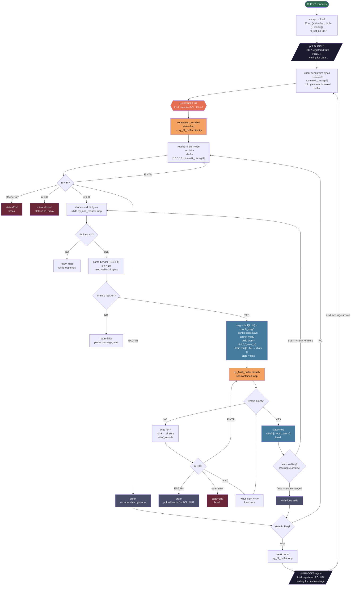

# Event Loop Flow — Single Request Traced (v2)

## Byte Math First

```
message = "conn0_msg0"
c-o-n-n-0-_-m-s-g-0 = 10 bytes

what travels over the wire:
[10, 0, 0, 0,  c, o, n, n, 0, _, m, s, g, 0]
 ←— 4 bytes —→ ←————————— 10 bytes —————————→
   header=10      actual message

total on wire = 14 bytes

reply = "world" = 5 bytes
reply on wire:
[5, 0, 0, 0,  w, o, r, l, d]
 ←— 4 bytes→ ←— 5 bytes ——→

total reply on wire = 9 bytes
```

---

## Buffer State at Each Step

| Step               | rbuf     | wbuf    |
| ------------------ | -------- | ------- |
| after read()       | 14 bytes | empty   |
| after parse header | 14 bytes | empty   |
| after build reply  | 14 bytes | 9 bytes |
| after drain(0..14) | 0 bytes  | 9 bytes |
| after write()      | 0 bytes  | 0 bytes |

---

## Call Chain (v2 — no middlemen)

```
OLD:  connection_io → state_req → try_fill_buffer → try_one_request → state_res → try_flush_buffer
NEW:  connection_io → try_fill_buffer → try_one_request → try_flush_buffer
```

`state_req` and `state_res` are deleted entirely.
The loops they contained now live inside `try_fill_buffer` and `try_flush_buffer` directly.

---

## Full Flow

```
client connects
→ accept() gives us fd=7
→ Conn { fd=7, state=Req, rbuf=[], wbuf=[] }
→ fd_set_nb(7) → make it nonblocking

next poll() iteration:
  fd=7 is Req state → register with POLLIN
  "wake me when fd=7 has data to read"
  poll() blocks...

client sends "conn0_msg0":
  wire bytes = [10,0,0,0, c,o,n,n,0,_,m,s,g,0]  (14 bytes total)
  kernel buffers these 14 bytes
  kernel wakes poll() → fd=7 revents=POLLIN

connection_io(conn) called
  state=Req → calls try_fill_buffer(conn) directly

try_fill_buffer (self-contained loop):
  rv = read(fd=7, buf, 4096)
  rv = 14 ← positive, got 14 bytes
  rbuf.extend → rbuf = [10,0,0,0,c,o,n,n,0,_,m,s,g,0]  (14 bytes)

  → while try_one_request(conn) {}

      try_one_request:
        rbuf.len() = 14, is 14 >= 4? YES → parse header
        header bytes = [10,0,0,0]
        u32::from_le_bytes → len = 10

        is 4 + 10 <= 14? YES (exactly 14) → we have the full message

        msg = rbuf[4..14] = "conn0_msg0"
        println!("client says: conn0_msg0")

        build reply:
          reply = b"world" = 5 bytes
          reply_len = 5
          wbuf = [5,0,0,0, w,o,r,l,d]  (9 bytes)

        drain rbuf:
          remove rbuf[0..14]  (4 header + 10 body)
          rbuf = []  ← empty now

        state = Res
        calls try_flush_buffer(conn) directly

        try_flush_buffer (self-contained loop):
          remain = wbuf[0..] = 9 bytes
          rv = write(fd=7, wbuf, 9)
          rv = 9 ← kernel accepted all 9 bytes
          wbuf_sent = 9
          wbuf_sent == wbuf.len()? YES → fully sent
          state = Req  ← back to reading
          wbuf = [], wbuf_sent = 0
          break  ← loop ends, returns to try_one_request

        state is now Req
        return conn.state == State::Req → return true
        "finished AND state is back to Req, check for more"

  try_one_request returned true → while loop runs again
    try_one_request:
      rbuf.len() = 0, is 0 >= 4? NO
      return false ← not enough data, while loop ends

  check: conn.state != State::Req? NO → do not break
  loop back to read() at top of try_fill_buffer
    rv = read(fd=7, buf, 4096)
    rv = -1, errno = EAGAIN ← no more data right now
    break ← loop ends, try_fill_buffer returns

back in main loop

next poll() iteration:
  fd=7 still in Req state → register POLLIN again
  poll() blocks waiting for client's next message
```

---

## Diagram


