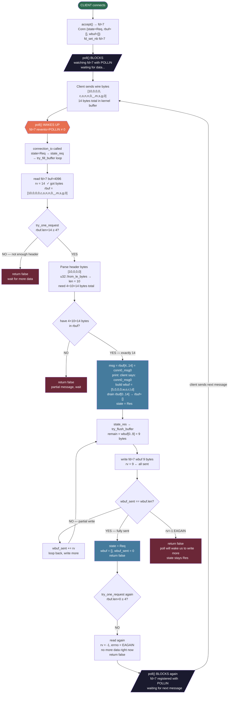

# Event Loop Flow — Single Request Traced

## Byte Math First

```
message = "conn0_msg0"
c-o-n-n-0-_-m-s-g-0 = 10 bytes

what travels over the wire:
[10, 0, 0, 0,  c, o, n, n, 0, _, m, s, g, 0]
 ←— 4 bytes —→ ←————————— 10 bytes —————————→
   header=10      actual message

total on wire = 14 bytes

reply = "world" = 5 bytes
reply on wire:
[5, 0, 0, 0,  w, o, r, l, d]
 ←— 4 bytes→ ←— 5 bytes ——→

total reply on wire = 9 bytes
```

---

## Buffer State at Each Step

| Step               | rbuf     | wbuf    |
| ------------------ | -------- | ------- |
| after read()       | 14 bytes | empty   |
| after parse header | 14 bytes | empty   |
| after build reply  | 14 bytes | 9 bytes |
| after drain(0..14) | 0 bytes  | 9 bytes |
| after write()      | 0 bytes  | 0 bytes |

---

## Full Flow

```
client connects
→ accept() gives us fd=7
→ Conn { fd=7, state=Req, rbuf=[], wbuf=[] }
→ fd_set_nb(7) → make it nonblocking

next poll() iteration:
  fd=7 is Req state → register with POLLIN
  "wake me when fd=7 has data to read"
  poll() blocks...

client sends "conn0_msg0":
  wire bytes = [10,0,0,0, c,o,n,n,0,_,m,s,g,0]  (14 bytes total)
  kernel buffers these 14 bytes
  kernel wakes poll() → fd=7 revents=POLLIN

connection_io(conn) called
  state=Req → calls state_req(conn)
    state_req calls try_fill_buffer in a loop

try_fill_buffer:
  rv = read(fd=7, buf, 4096)
  kernel gives: [10,0,0,0, c,o,n,n,0,_,m,s,g,0]
  rv = 14  ← positive, we got 14 bytes
  rbuf.extend → rbuf = [10,0,0,0,c,o,n,n,0,_,m,s,g,0]  (14 bytes)

  → calls try_one_request:

      rbuf.len() = 14, is 14 >= 4? YES → parse header
      header bytes = [10,0,0,0]
      u32::from_le_bytes → len = 10

      is 4 + 10 <= 14? YES (exactly 14) → we have the full message

      msg = rbuf[4..14] = "conn0_msg0"
      println!("client says: conn0_msg0")

      build reply:
        reply = b"world" = 5 bytes
        reply_len = 5
        wbuf = [5,0,0,0, w,o,r,l,d]  (9 bytes)

      drain rbuf:
        remove rbuf[0..14]  (4 header + 10 body)
        rbuf = []  ← empty now

      state = Res
      calls state_res immediately
        calls try_flush_buffer:
          remain = wbuf[0..] = 9 bytes
          rv = write(fd=7, wbuf, 9)
          rv = 9  ← kernel accepted all 9 bytes
          wbuf_sent = 9
          wbuf_sent == wbuf.len()? YES → fully sent
          state = Req  ← back to reading
          wbuf = []
          wbuf_sent = 0
          return false  ← stop flushing
        try_flush_buffer returned false → state_res returns

      state is now Req
      try_one_request returns true
      "I finished AND state is back to Req, check for more data"

  try_one_request returned true → while loop runs again
    try_one_request:
      rbuf.len() = 0, is 0 >= 4? NO
      return false  ← not enough data

  while loop ends
  loops back to read() at top of try_fill_buffer
    rv = read(fd=7, buf, 4096)
    rv = -1, errno = EAGAIN  ← no more data right now
    return false  ← stop filling

state_req loop ends
back in main loop

next poll() iteration:
  fd=7 still in Req state → register POLLIN again
  poll() blocks waiting for client's next message
```

---

## Diagram


